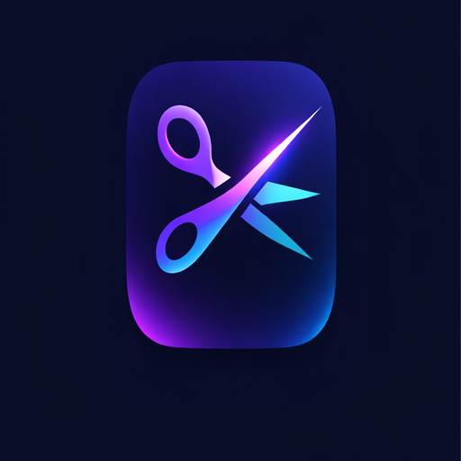

<p align="center">
  
</p>

# LightCutVidz

Lightweight desktop video editor for macOS and Linux. No external dependencies — FFmpeg is bundled inside the app.


---

## Features

- **Open video** — drag & drop or `Ctrl/Cmd+O` (MP4, MOV, AVI, MKV, WebM, FLV, M4V)
- **Playback** — play/pause, seekbar with drag support
- **Speed control** — 0.25× to 4× with presets and fine-grained slider
- **Multi-segment trim** — draw cut zones on the timeline, adjust start/end with precise time inputs, delete individually
- **Timeline filmstrip** — thumbnail strip extracted from the video for visual reference
- **Crop** — draw a selection overlay, confirm with Enter or Apply; a red frame shows the active crop zone
- **Mute** — toggle audio on/off
- **Undo / Redo** — full history for every edit (speed, mute, crop, cuts) via `Ctrl/Cmd+Z` / `Ctrl+Y`
- **Export** — MP4, MOV, WebM, AVI, GIF with real-time progress bar
- **Full screen** — `F11` / `Ctrl+Cmd+F`, exit with `Escape`

---

## Download

Grab the latest build from the [Releases page](https://github.com/light-cut-vidz/light-cut-vidz/releases/latest).

| Platform | File |
|----------|------|
| macOS — Apple Silicon (M1/M2/M3/M4) | `LightCutVidz-mac-arm64.dmg` |
| macOS — Intel (2019 and earlier)     | `LightCutVidz-mac-x64.dmg` |
| Linux (Ubuntu / Debian) | `lightcutvidz_x.x.x_amd64.deb` |
| Linux (other) | `LightCutVidz-x.x.x.AppImage` |

> **Not sure which Mac you have?** Click the Apple menu → **About This Mac**. If it says "Apple M…" → arm64. If it says "Intel" → x64.

### macOS — Homebrew (recommended)

```bash
brew install --cask light-cut-vidz/tap/lightcutvidz
```

### macOS — DMG (manual)

1. Download the DMG matching your Mac (see table above)
2. Open the DMG and drag **LightCutVidz** into your **Applications** folder
3. **First launch only** (Gatekeeper bypass — the app is not Apple-signed):
   - **Right-click** the app → **Open**
   - Click **Open** in the dialog that appears
4. From then on, double-clicking works normally

> LightCutVidz is open-source. No Apple certificate is applied.

### Linux — Snap (recommended)

```bash
sudo snap install lightcutvidz
```

### Linux — One-line installer

Works on Ubuntu, Debian, Fedora, Arch and most other distributions:

```bash
curl -fsSL https://raw.githubusercontent.com/light-cut-vidz/light-cut-vidz/main/install.sh | bash
```

This script automatically:
- Detects your distribution
- Downloads the `.deb` (Ubuntu/Debian) or `.AppImage` (others)
- Installs it and adds a launcher entry to your applications menu

### Linux — Manual install

**Ubuntu / Debian** — double-click the `.deb` or run:

```bash
sudo apt install ./lightcutvidz_x.x.x_amd64.deb
```

**Other distributions** — AppImage (no install needed):

```bash
chmod +x LightCutVidz-*.AppImage
./LightCutVidz-*.AppImage
```

If the AppImage fails to start, install FUSE:

```bash
# Ubuntu / Debian
sudo apt install libfuse2

# Fedora
sudo dnf install fuse
```

---

## Usage

### 1. Import a video

On launch, you land on the home screen. Two options:
- **Drag & drop** a video file anywhere in the window
- Click **Browse files** or press `Ctrl/Cmd+O` to open the file picker

Supported formats: MP4, MOV, AVI, MKV, WebM, FLV, M4V

> When a video is opened, LightCutVidz automatically transcodes it to WebM for preview. This takes a few seconds depending on the file size — it is required because Electron does not ship with H.264/AAC codecs.

---

### 2. Playback controls

| Action | How |
|--------|-----|
| Play / Pause | Click the play button or press `Space` |
| Seek | Click or drag anywhere on the seekbar |
| Full screen | `F11` (Linux) / `Ctrl+Cmd+F` (macOS) or menu View → Toggle Full Screen |
| Exit full screen | `Escape` |

---

### 3. Speed

In the toolbar, click a speed preset or use the slider:

`0.25×` · `0.5×` · `0.75×` · `1×` · `1.25×` · `1.5×` · `2×` · `3×` · `4×`

The speed is applied both during playback and at export (via FFmpeg `setpts` + `atempo` filters).

---

### 4. Trim — Remove parts of the video

The timeline shows the full video duration. **Red zones = parts that will be removed.**

**Create a cut:**
1. Click and drag on the timeline to draw a red zone
2. Repeat as many times as needed — overlapping zones are automatically merged

**Adjust a cut:**
- **Move** — drag the center of a red zone
- **Resize** — drag the left or right edge
- **Edit precisely** — click a zone to open the time editor (type `1:23.4` or `83.5` seconds)
- **Delete** — click the `×` button on a zone, or select it and press the delete button in the editor

**Clear all cuts:** click **Clear all cuts** in the timeline bar.

---

### 5. Crop

1. Click **Crop** in the toolbar — a selection overlay appears on the video
2. Drag the corner handles to resize the crop area
3. Drag inside the selection to move it
4. Press **Enter** or click **✓ Apply** to confirm
5. A thin red frame appears on the video indicating the active crop zone

To reset the crop, click **Reset crop** in the toolbar.

---

### 6. Audio

Click the **Sound / Muted** button in the toolbar to toggle.

- **Sound On** — audio is preserved at export
- **Muted** — audio track is removed at export

---

### 7. Undo / Redo

All edits (speed, mute, crop, cuts) are fully undoable:

| Action | Shortcut |
|--------|----------|
| Undo | `Ctrl+Z` / `Cmd+Z` |
| Redo | `Ctrl+Y` / `Cmd+Shift+Z` |

Or use the **Edit** menu.

---

### 8. Export

Click **Export** in the toolbar.

1. Review the summary (output duration, speed, audio, crop, number of cuts)
2. Choose an output format:

| Format | Notes |
|--------|-------|
| MP4 | H.264 — best universal compatibility |
| MOV | QuickTime — ideal for macOS / Final Cut |
| WebM | VP9 — optimized for the web |
| AVI | Legacy Windows compatibility |
| GIF | Animated image (480px wide, 15 fps) |

3. Click **Export**, choose the output file location
4. A progress bar tracks the encoding — do not close the app during export

---

## Uninstall

### macOS — Homebrew

```bash
brew uninstall --cask lightcutvidz
```

### macOS — DMG (manual install)

Drag **LightCutVidz** from your **Applications** folder to the Trash, or run:

```bash
rm -rf /Applications/LightCutVidz.app
```

### Linux — Snap

```bash
sudo snap remove lightcutvidz
```

### Linux — Ubuntu / Debian (installed via `.deb` or the one-line installer)

```bash
sudo apt remove lightcutvidz
```

### Linux — AppImage (installed manually)

```bash
rm ~/.local/bin/LightCutVidz.AppImage
rm ~/.local/share/applications/lightcutvidz.desktop
rm ~/.local/share/icons/hicolor/512x512/apps/lightcutvidz.png
update-desktop-database ~/.local/share/applications
```

---

## Development

### Prerequisites

- Node.js 20+
- npm

### Install

```bash
git clone https://github.com/light-cut-vidz/light-cut-vidz.git
cd light-cut-vidz
npm install --legacy-peer-deps
```

### Run in dev mode

```bash
npm run dev
```

Starts the Vite dev server on `localhost:5173` and opens the Electron window with hot reload.

### Build the packaged app

```bash
npm run build
```

Outputs to `dist-app/`:
- **Linux** → `LightCutVidz-x.x.x.AppImage` + `lightcutvidz_x.x.x_amd64.deb`
- **macOS** → `LightCutVidz-mac-arm64.dmg` (Apple Silicon) + `LightCutVidz-mac-x64.dmg` (Intel)

### Scripts

| Command | Description |
|---------|-------------|
| `npm run dev` | Start Electron + Vite in development mode |
| `npm run build` | Build and package the app |
| `npm run vite:build` | Build the Vite frontend only |
| `npm run test` | Run unit tests |
| `npm run test:watch` | Watch mode |
| `npm run test:coverage` | Tests with coverage report |
| `npm run lint` | ESLint on renderer source |
| `npm run typecheck` | TypeScript type check (no emit) |

---

## CI / CD

Every push to `main` or `develop` runs the CI pipeline automatically:

1. **Lint** — ESLint
2. **Type check** — `tsc --noEmit`
3. **Tests** — Vitest with coverage artifact
4. **Build** — Vite frontend build artifact

### Release a new version

```bash
git tag v1.0.0
git push origin v1.0.0
```

The release workflow triggers automatically on the tag, builds the DMG (macOS runner) and AppImage + deb (Linux runner), and publishes all three to the GitHub Releases page.

---

## Project structure

```
light-cut-vidz/
├── src/
│   ├── main/
│   │   └── index.js          # Electron main process — IPC handlers, FFmpeg calls, native menu
│   ├── preload/
│   │   └── index.js          # contextBridge — exposes safe APIs to the renderer
│   └── renderer/
│       └── src/
│           ├── App.tsx
│           ├── components/
│           │   ├── VideoPlayer.tsx     # HTML5 video element
│           │   ├── VideoControls.tsx   # play/pause + seekbar
│           │   ├── Timeline.tsx        # trim editor + filmstrip
│           │   ├── FilmStrip.tsx       # thumbnail extraction
│           │   ├── CropOverlay.tsx     # interactive crop selection
│           │   ├── CropFrame.tsx       # red frame after crop applied
│           │   ├── Toolbar.tsx         # speed, mute, crop, export buttons
│           │   ├── ExportModal.tsx
│           │   ├── DropZone.tsx
│           │   └── Toast.tsx
│           ├── hooks/
│           │   └── useHistory.ts       # unified undo/redo
│           └── utils/
│               └── time.ts             # format / parse time strings
├── .github/
│   └── workflows/
│       ├── ci.yml        # lint + typecheck + tests + vite build
│       └── release.yml   # build DMG + AppImage + deb on tag push
├── vite.config.ts
├── vitest.config.ts
├── tsconfig.json
├── eslint.config.js
└── package.json
```

---

## Tech stack

| Layer | Technology |
|-------|-----------|
| Desktop shell | Electron 41 |
| UI | React 19 + TypeScript |
| Bundler | Vite 8 |
| Video processing | FFmpeg (bundled via `ffmpeg-static` + `@ffprobe-installer/ffprobe`) |
| FFmpeg Node API | `fluent-ffmpeg` |
| Packaging | `electron-builder` |
| Tests | Vitest + Testing Library |
| Linter | ESLint (flat config) |

### Architecture notes

**Why WebM for preview?**
Electron ships without patented codecs (H.264, AAC). When a video is loaded, the main process transcodes it to WebM (VP9 + Opus) using the bundled FFmpeg before handing it to the HTML5 player.

**Why `asarUnpack`?**
Native binaries cannot be executed from inside an `.asar` archive. The `asarUnpack` field in `package.json` and the `fixAsarPath()` helper in the main process ensure FFmpeg is always accessible on the filesystem.

**Undo / Redo**
All editable state (speed, mute, crop, cut segments) is managed by a single `useEditorHistory` hook. Every setter snapshots the full previous state onto a stack, so Undo/Redo work uniformly across all edit types with no extra code per feature.

---

## License

ISC
